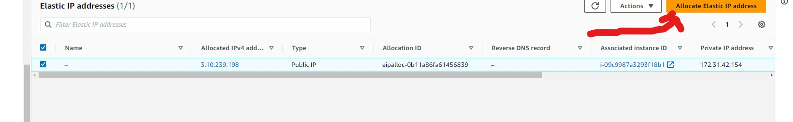

# CONFIGURE NGINX AS A LOAD BALANCER

AIM OF THE PROJECT:
*This project aims to expand the knowledge of a DevOps engineer by configuring an Nginx Load Balancer solution and implementing HTTPS protocol to ensure secure connections between clients and web servers. This will involve the use of SSL/TLS cryptographic protocols  to protect against Man-In-The-Middle (MITM) attacks, with the creation of an encrypted session between the browser and the web server. SSL/TLS digital certificates will be used to validate and identify websites, with Let's Encrypt being a recommended Certificate Authority. The shell client cetrbot will be used to automate certificate issuance.*

The Architecture of the Solution is shown below:


STEP 1: Install nginx

Create and EC2 based on Ubuntu server 20.04 LTS and give it a name. 

NOTE: Ensure that port 443 for HTTPS and port 80 for HTTP are opened on your instance security group for easy connection

Lunch your server on your terminal and update it.

`sudo apt update`

Open the `/etc/hosts` file to update it with your server 1 and 2 private ip addresses

`sudo vi /etc/hosts` and save.


Install nginx with

`sudo apt install nginx -y`

`sudo systemctl enable nginx`

Check if nginx is up and running with `sudo systemctl status nginx`.

Step 2: Register a domain name 

To get a valid SSL certificate, register a domain with any [domain registrar](https://en.wikipedia.org/wiki/Domain_name_registrar) of your choice e.g [Godaddy](https://godaddy.com/), [Domain](https://www.domain.com/), [Bluehost](https://www.bluehost.com/), e.t.c

NOTE: I will be using Godaddy for illustration purpose.

Register a new domain name in any domain zone. For example, `.com`, `.net`, `.org`, `.edu` e.t.c

After you have created your domain name, click on my domain, check the box at the back of it and select "Nameservers"


Go back to your AWS console and search for "Route 53" and click on "create hosted zone"


After hosted zone has been created, for our "Route 53" to be connected to our domain you will copy each line of the cycled part in the image below into the each line of the Nameserver on your domain name and save.


The next thing is to create record but before doing that you need to create an "Elastic IP" and to do that you need to click on Elastic IP


Click on "Allocate Elasstic IP Address"



Ensure that you select the available zone of the instance you want to associate your Elastic IP with.


Click on "Allocate" and check the hosted zone you created and click on action and select Associate Elastic IP Address


Then, choose the server you want to link the Elastic IP with (ngins server) and click allocate.


Copy the Elastic IP address and go back to the "Route 53" where you have your created "hosted zone" and click on "Create Record".

Enter the Elastic IP address into "value" box and enter "www" into "Record name" box and then click on "Add another record" and paste in the Elastic IP address into "value" box and then click create record.


If everything is done well, you should have a page that looks like this:


Now go back to your nginx server on your terminal.

Step 3: Configure Nginx as a Load Balancer

Configure nginx as load balancer using the web servers name used in the `/etc/hosts` file

To configure nginx, open the configuration file with `sudo vi /etc/nginx/nginx.conf` and add the script below to the "http" section of the file. 

```
upstream myproject {
    server Web1 weight=5;
    server Web2 weight=5;
  }

server {
    listen 80;
    server_name www.domain.com;
    location / {
      proxy_pass http://myproject;
    }
  }
  ```

  Look for this line `include /etc/nginx/sites-enabled/*;` and comment it by adding # to the beginning. 

Ensure that you replace "www.domain.com" with the domain name you just created. 


Restart the nginx server and check the status:

`sudo systemctl restart nginx`

`sudo systemctl status nginx`

Check that your webservers can be reached from browser with the domain name you have created using HTTP protocol `http://www.<your-domain-name>`

If your configuration is okay, you should see something like this:


Step 4: Configure secure connection using SSL/TLS certificates

To do this, you need to check if your "snapd" service is running with `sudo systemctl status snapd`. If it is running then, you have to install `certbot`

`sudo snap install --classic certbot`

Request your certificate (just follow the certbot instructions and note that you will need to choose the domain you want your certificate to be issued for, domain name will be looked up from nginx.conf file)

NOTE: Don't forget the domain name is the one you created and mentioned in your nginx configuration file. 

If everything went well you should get the type of result below: 


Run the following commands and test your secure access to your web solution by trying to reach `https://www.your-domain-name`


If your configuration is okay you should see the page with key at the beggining of the address


Click on the padlock icon and you can see the details of the certificate issued for your website.


Set up periodical renewal of your SSL/TLS certificate
By default, LetsEncrypt certificate is valid for 90 days, so it is recommended to renew it at least every 60 days or more frequently.

You can test renewal command in `dry-run` mode

`sudo certbot renew --dry-run`

Best pracice is to have a scheduled job that to run renew command periodically. Let us configure a cronjob to run the command twice a day.

To do so, open the crontab file `sudo vi crontab -e` and add

`* */12 * * *   root /usr/bin/certbot renew > /dev/null 2>&1`


Congratulations you have successfully implemented Nginx Load Balancer with a secure connection (HTTPS) with periodically updated SSL/TLS certificates


